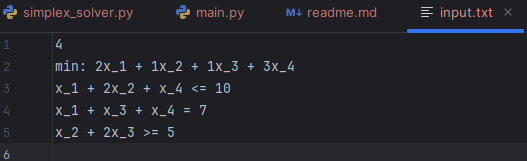
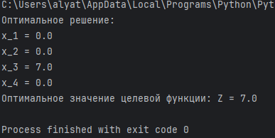
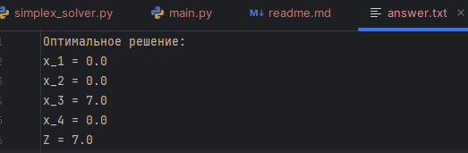

# Отчёт по лабораторной работе  
## Решение задачи линейного программирования (ЗЛП) с помощью simplex-метода

---

### Автор
**Гайдук Алина Сергеевна**  
Поток: **МЕТОПТ 1.1**

---

### Ревью
[Ссылка на ревью](https://drive.google.com/drive/folders/1G4bvDQSj_QgnQ6PwOOPwnAJ4ArjQjogk?dmr=1&ec=wgc-drive-hero-goto)

---

### Цель работы
Закрепить навыки:
- приведения задачи линейного программирования к каноническому виду,
- построения вспомогательной задачи для нахождения допустимого базиса,
- решения основной задачи с помощью симплекс-метода,
- реализации алгоритма на языке Python.

---

### Алгоритм:

#### Phase I — Вспомогательная задача (поиск допустимого базиса)

Если в системе ограничений есть знаки `≥` или `=`, из них невозможно напрямую получить единичную матрицу для начального базиса.  
Для этого вводятся **искусственные переменные** \(r_i\), которые временно делают систему совместной:

```
min w = sum r_i
```


После решения этой вспомогательной задачи:
- если \( w^* = 0 \) → все \( r_i = 0 \), базис найден, система совместна;
- если \( w^* > 0 \) → система ограничений несовместна, решения нет.

---

#### Удаление искусственных переменных

После фазы I искусственные переменные **удаляются из таблицы**,  
так как они не входят в исходную задачу и больше не влияют на целевую функцию.

---

#### Phase II — Основная задача

На этой фазе восстанавливается исходная целевая функция:
```
min Z = c^T x
```
и проводится обычный симплекс-процесс:

1. Строится строка редуцированных стоимостей:  
   `Delta = C_B A_B^{-1}A - C)`.
2. Выбирается **ведущий столбец**:
   - для задачи **min** — с наибольшей положительной Δ;
   - для **max** — с наибольшей отрицательной Δ.
3. Выбирается **ведущая строка** по правилу минимального отношения \(Q = b_i / a_{i,j} > 0\).
4. Выполняется **поворот (pivot)**:
   - нормировка строки на ведущий элемент;
   - обнуление столбца во всех других строках.
5. Процесс повторяется, пока все Δ ≤ 0 (для min) — найден оптимум.

---


### Псевдокод:

1. Считать входные данные (цель, ограничения, число переменных)

2. Преобразовать ограничения к равенствам:

   - для ≤: добавить +s (slack)

   - для ≥: добавить -s и +r (искусственные)

   - для =: добавить +r

3. Составить таблицу симплекса для Phase I: min w = Σr

4. Выполнять симплекс-итерации до тех пор, пока есть Δ > 0:

   - выбрать ведущий столбец (max Δ)
   - выбрать ведущую строку (min b/a > 0)
   - выполнить pivot

Если w* > 0 → система несовместна, конец.

5. Удалить столбцы искусственных переменных.

6. Восстановить исходную целевую функцию.

7. Повторять симплекс-итерации до оптимальности:

    - (для min: пока Δ > 0; для max: пока Δ < 0)

8. Вывести оптимальный план и значение функции.

---

### Инструкция по запуску программы

*Требования*

    - Python: версия 3.8+
    - Библиотеки: используются только стандартные библиотеки Python

1. Склонировать репозиторий:

   ```
   git clone https://github.com/wurlinney/optimization_methods_lab1.git
   ```
   
2. Перейти в директорию репозитория:
```
cd optimization_methods_lab1
```
   
3. Запустить программу:

```
python main.py
```

4. Результаты будут записаны в файл output.txt и выведены в консоль.

---

### Демонстрация работы программы

### Вариант задания
Решить задачу линейного программирования:

**Целевая функция:**

```
min Z = 2x_1 + x_2 + x_3 + 3x_4
```


**Ограничения:**

```
x_1 + 2x_2 + x_4 <= 10
x_1 + x_3 + x_4 = 7
x_2 + 2x_3 >= 5
x_i >= 0
```

Входные данные размещены в файле input.txt (см. в файлах репозитория).


Программа запускается через файл main.py. Функция `read_lp` читает файл с входными данными и возвращает количество переменных, список ограничений и кортеж (тип задачи, целевая функция).
В функции `main()` вызываются методы класса `SimplexTwoPhase`, которые находят оптимальное решение задачи и оптимальное значение целевой функции. Ответ выводится в консоль, а также записывается в файл `answer.txt`.



---

### Вывод по работе

В работе реализован двухфазный симплекс-метод на языке **Python**  
для решения задач линейного программирования в общем виде.

Программа:
- считывает данные из текстового файла;
- приводит задачу к каноническому виду;
- выполняет Phase I (поиск допустимого базиса) и Phase II (оптимизация);
- выводит оптимальный план и значение целевой функции.


В ходе работы:
- закреплены знания о канонической форме ЗЛП и симплекс-таблицах;
- освоена реализация pivot-операций и точные вычисления через `Fraction`;
- устранены ошибки построения фазы I с помощью пошаговой отладки.

**Итог:** задача выполнена успешно, метод реализован корректно,  
получено чёткое понимание принципа работы симплекс-метода.
